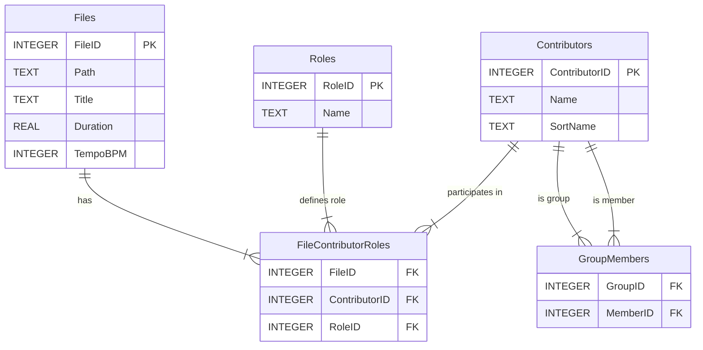

# Database Documentation

This document describes the SQLite database structure used by the Gosling2 application.

## Overview

- **Database Engine**: SQLite 3
- **File Location**: `sqldb/gosling2.sqlite3`
- **Foreign Keys**: Enabled (`PRAGMA foreign_keys = ON`)

## 🛡️ Schema Governance (Strict Mode)

This database schema is **Strictly Enforced** by the test suite. 
Any change to Tables or Columns (adding, removing, renaming) **MUST** be accompanied by updates to:
1.  `src/completeness_criteria.json`
2.  `Song` Model (`src/data/models/song.py`)
3.  `SongRepository` Whitelists
4.  UI and Service components

**Do not manually modify the schema** without running `pytest` to identify all 9 layers of broken dependencies. The system is designed to "yell" at you if you simply `ALTER TABLE` without updating the code.

## Schema Diagram



## Tables

### 1. `Files`
Stores information about each music file in the library.

| Column | Type | Constraints | Description |
|--------|------|-------------|-------------|
| `FileID` | INTEGER | PRIMARY KEY | Unique identifier for the file |
| `Path` | TEXT | NOT NULL UNIQUE | Absolute file path |
| `Title` | TEXT | NOT NULL | Track title (from metadata or filename) |
| `Duration` | REAL | - | Duration in seconds |
| `TempoBPM` | INTEGER | - | Beats per minute |

### 2. `Contributors`
Stores unique names of all people or groups involved in the music (artists, composers, etc.).

| Column | Type | Constraints | Description |
|--------|------|-------------|-------------|
| `ContributorID` | INTEGER | PRIMARY KEY | Unique identifier for the contributor |
| `Name` | TEXT | NOT NULL UNIQUE | Display name |
| `SortName` | TEXT | - | Name used for sorting (e.g., "Beatles, The") |

### 3. `Roles`
Defines the types of participation a contributor can have.

| Column | Type | Constraints | Description |
|--------|------|-------------|-------------|
| `RoleID` | INTEGER | PRIMARY KEY | Unique identifier for the role |
| `Name` | TEXT | NOT NULL UNIQUE | Role name (e.g., "Performer", "Composer") |

**Default Roles:**
- Performer
- Composer
- Lyricist
- Producer

### 4. `FileContributorRoles` (Junction Table)
Links Files, Contributors, and Roles to represent "Who did what on which track".

| Column | Type | Constraints | Description |
|--------|------|-------------|-------------|
| `FileID` | INTEGER | FK, NOT NULL | Reference to `Files` |
| `ContributorID` | INTEGER | FK, NOT NULL | Reference to `Contributors` |
| `RoleID` | INTEGER | FK, NOT NULL | Reference to `Roles` |

**Constraints:**
- Primary Key: `(FileID, ContributorID, RoleID)`
- `ON DELETE CASCADE` for FileID and ContributorID

### 5. `GroupMembers` (Self-Reference Junction)
Represents relationships between contributors (e.g., a band and its members).

| Column | Type | Constraints | Description |
|--------|------|-------------|-------------|
| `GroupID` | INTEGER | FK, NOT NULL | ID of the group (from `Contributors`) |
| `MemberID` | INTEGER | FK, NOT NULL | ID of the member (from `Contributors`) |

**Constraints:**
- Primary Key: `(GroupID, MemberID)`

## Repositories

Database access is managed through the Repository pattern in `src/data/repositories/`:

- **`BaseRepository`**: Handles connection lifecycle and schema creation.
- **`SongRepository`**: Manages `Files` and related `FileContributorRoles`.
- **`ContributorRepository`**: Manages `Contributors` and `GroupMembers`.

## Usage Example

Relationship querying is typically handled via `JOIN` operations.

**Get all performers for a song:**
```sql
SELECT c.Name
FROM Contributors c
JOIN FileContributorRoles fcr ON c.ContributorID = fcr.ContributorID
JOIN Roles r ON fcr.RoleID = r.RoleID
WHERE fcr.FileID = ? AND r.Name = 'Performer'
```
