# Database Documentation

This document describes the SQLite database structure used by the Gosling2 application.

## Overview

- **Database Engine**: SQLite 3
- **File Location**: `sqldb/gosling2.sqlite3`
- **Foreign Keys**: Enabled (`PRAGMA foreign_keys = ON`)
- **Total Tables**: 25 (including junctions and lookups)

## 🛡️ Schema Governance (Strict Mode)

This database schema is **Strictly Enforced** by the test suite. 
Any change to Tables or Columns (adding, removing, renaming) **MUST** be accompanied by updates to:
1.  `src/completeness_criteria.json`
2.  Models in `src/data/models/`
3.  Repository Whitelists in `src/data/repositories/`
4.  UI and Service components

**Do not manually modify the schema** without running `pytest` to identify all layers of broken dependencies. The system is designed to "yell" at you if you simply `ALTER TABLE` without updating the code.

> [!IMPORTANT]
> **Priority Rule:** The "9 Layers of Yell" validation steps take priority over everything. You are strictly forbidden from adding columns to the database if they are not actively used by the application logic. **Dead schema elements are treated as bugs.**

## ✅ Completeness Criteria (IsDone Flag)

A song can only be marked as "Done" (`IsDone = true`) if it passes validation defined in `src/completeness_criteria.json`.

### Mandatory Fields (All Types)
| Field | Requirement | Notes |
|-------|-------------|-------|
| `name` | Not empty | From ID3 or filename |
| `source` | Not empty | File path or URL must be valid |
| `duration` | ≥ 30 seconds | Prevents stub files |

### Mandatory Tags (Songs Only)
| Category | Requirement |
|----------|-------------|
| Genre | At least 1 tag with `Category = 'Genre'` |
| Language | At least 1 tag with `Category = 'Language'` |
| Artist | At least 1 Contributor with Role = 'Performer' |

### Optional Fields
| Field | Notes |
|-------|-------|
| `TempoBPM` | Recommended for mixing |
| `ISRC` | International Standard Recording Code |
| `RecordingYear` | Original recording year |

> **Config location:** `src/completeness_criteria.json`
> **Enforcement:** Validation service checks before setting IsDone

## Schema Diagram

```mermaid
erDiagram
    Types ||--|{ MediaSources : "categorizes"
    MediaSources ||--o| Songs : "extends"
    MediaSources ||--o| Streams : "extends"
    MediaSources ||--o| Commercials : "extends"
    MediaSources ||--|{ MediaSourceTags : "has"
    Tags ||--|{ MediaSourceTags : "applied to"
    Tags ||--o{ TagRelations : "parent of"
    Tags ||--o{ AutoTagRules : "applied by"
    MediaSources ||--|{ MediaSourceContributorRoles : "has"
    Contributors ||--|{ MediaSourceContributorRoles : "participates in"
    Contributors ||--|{ ContributorAliases : "known as"
    Roles ||--|{ MediaSourceContributorRoles : "defines role"
    Contributors ||--|{ GroupMembers : "is group"
    Contributors ||--|{ GroupMembers : "is member"
    Songs ||--|{ SongAlbums : "appears on"
    Albums ||--|{ SongAlbums : "contains"
    Albums ||--|{ AlbumPublishers : "published by"
    Publishers ||--|{ AlbumPublishers : "publishes"
    Commercials ||--o| Campaigns : "belongs to"
    Campaigns ||--o| Clients : "belongs to"
    Clients ||--o| Agencies : "represented by"
    Playlists ||--|{ PlaylistItems : "contains"
    MediaSources ||--|{ PlaylistItems : "appears in"
    MediaSources ||--o{ PlayHistory : "played as"
    MediaSources ||--o{ ChangeLog : "edited in"
    MediaSources ||--o{ ActionLog : "acted on"

    Types {
        INTEGER TypeID PK
        TEXT TypeName
    }

    MediaSources {
        INTEGER SourceID PK
        INTEGER TypeID FK
        TEXT Name
        TEXT Source
        REAL Duration
        TEXT Notes
        BOOLEAN IsActive
    }

    Songs {
        INTEGER SourceID PK
        INTEGER TempoBPM
        INTEGER RecordingYear
        TEXT ISRC
        BOOLEAN IsDone
    }

    Streams {
        INTEGER SourceID PK
        TEXT FailoverURL
        TEXT StreamFormat
    }

    Commercials {
        INTEGER SourceID PK
        INTEGER CampaignID FK
    }

    Tags {
        INTEGER TagID PK
        TEXT TagName
        TEXT Category
    }

    MediaSourceTags {
        INTEGER SourceID FK
        INTEGER TagID FK
    }

    Contributors {
        INTEGER ContributorID PK
        TEXT Name
        TEXT SortName
        TEXT Type
    }

    ContributorAliases {
        INTEGER AliasID PK
        INTEGER ContributorID FK
        TEXT AliasName
    }

    Roles {
        INTEGER RoleID PK
        TEXT Name
    }

    Albums {
        INTEGER AlbumID PK
        TEXT Title
        TEXT AlbumType
        INTEGER ReleaseYear
    }

    Playlists {
        INTEGER PlaylistID PK
        TEXT Name
        TEXT Description
    }

    PlayHistory {
        INTEGER PlayID PK
        INTEGER SourceID FK
        DATETIME PlayedAt
        TEXT SnapshotName
    }

    ChangeLog {
        INTEGER LogID PK
        TEXT TableName
        INTEGER RecordID
        TEXT FieldName
    }

    ActionLog {
        INTEGER ActionID PK
        TEXT ActionType
        INTEGER TargetID
        TEXT Details
    }

    Agencies {
        INTEGER AgencyID PK
        TEXT Name
    }

    Clients {
        INTEGER ClientID PK
        INTEGER AgencyID FK
        TEXT Name
    }

    Campaigns {
        INTEGER CampaignID PK
        INTEGER ClientID FK
        TEXT CampaignName
    }

    Timeslots["Timeslots (PLANNED)"] {
        INTEGER TimeslotID PK
        TEXT Name
        TEXT StartTime
        TEXT EndTime
    }

    ContentRules["ContentRules (PLANNED)"] {
        INTEGER RuleID PK
        INTEGER TimeslotID FK
        INTEGER Position
        TEXT ContentType
    }

    Timeslots ||--|{ ContentRules : "defines"
```



> **Implementation Status:**
> - ✅ **Implemented:** Types, MediaSources, Songs, Streams, Commercials, Tags, Contributors, Playlists, and related junction tables
> - ⏸️ **Planned (Audit):** ChangeLog, PlayHistory, ActionLog, DeletedRecords — schema defined, not yet active
> - 🔮 **Future:** Timeslots, ContentRules — see [PROPOSAL_BROADCAST_AUTOMATION.md](.agent/PROPOSAL_BROADCAST_AUTOMATION.md)

---

## Core Tables

### 1. `Types` (Lookup)
Defines the content type for each media source.

| Column | Type | Constraints | Description |
|--------|------|-------------|-------------|
| `TypeID` | INTEGER | PRIMARY KEY | Unique identifier |
| `TypeName` | TEXT | NOT NULL UNIQUE | Type name |

**Default Types:**
| TypeID | TypeName | Description |
|--------|----------|-------------|
| 1 | Song | Music tracks |
| 2 | Jingle | Station identifiers |
| 3 | Commercial | Advertisements |
| 4 | VoiceTrack | Pre-recorded voice segments |
| 5 | Recording | Shows, interviews, reruns |
| 6 | Stream | Live audio feeds |

### 2. `MediaSources` (Base Table)
The base table for all playable content. Every audio item starts here.

| Column | Type | Constraints | Description |
|--------|------|-------------|-------------|
| `SourceID` | INTEGER | PRIMARY KEY | Unique identifier |
| `TypeID` | INTEGER | FK NOT NULL | Reference to `Types` |
| `Name` | TEXT | NOT NULL | Display name (from ID3 or filename) |
| `Notes` | TEXT | - | Searchable description |
| `Source` | TEXT | NOT NULL | File path (C:\...) or URL (https://...) |
| `Duration` | REAL | - | Duration in seconds (NULL for streams) |
| `IsActive` | BOOLEAN | DEFAULT 1 | Show in library (0 = hidden/inactive) |

**Notes:**
- `Source` field holds either a local file path or stream URL
- `IsActive = 0` hides the item from library without deleting
- Use for seasonal content, expired ads, or soft-delete

### 3. `Songs` (Music-Specific)
Extends `MediaSources` for music tracks with additional metadata and timing.

| Column | Type | Constraints | Description |
|--------|------|-------------|-------------|
| `SourceID` | INTEGER | PK, FK | Reference to `MediaSources` |
| `TempoBPM` | INTEGER | - | Beats per minute |
| `RecordingYear` | INTEGER | - | Original recording year |
| `ISRC` | TEXT | - | International Standard Recording Code |
| `IsDone` | BOOLEAN | DEFAULT 0 | Marked as complete/processed |
| `CueIn` | REAL | DEFAULT 0 | Playback start trim (seconds) |
| `CueOut` | REAL | - | Playback end trim (seconds) |
| `Intro` | REAL | - | End of talk-over zone at start |
| `Outro` | REAL | - | Start of talk-over zone at end |
| `HookIn` | REAL | - | Teaser segment start |
| `HookOut` | REAL | - | Teaser segment end |

**Timing Fields:**
```
|<--CueIn--|=====INTRO=====|-------BODY-------|=====OUTRO=====|--CueOut-->|
           ^               ^                   ^               ^
           0:02            0:15                3:30            3:45
           
|---HOOK---|
^          ^
1:00       1:10
```


**Constraints:**
- `ON DELETE CASCADE` from `MediaSources`

### 4. `Streams` (Remote Audio)
Extends `MediaSources` for live audio streams.

| Column | Type | Constraints | Description |
|--------|------|-------------|-------------|
| `SourceID` | INTEGER | PK, FK | Reference to `MediaSources` |
| `FailoverURL` | TEXT | - | Backup stream URL |
| `StreamFormat` | TEXT | - | 'MP3', 'AAC', 'FLAC' |

**Constraints:**
- `ON DELETE CASCADE` from `MediaSources`

### 5. `Commercials` (Ad-Specific)
Extends `MediaSources` for advertisements with campaign linking.

| Column | Type | Constraints | Description |
|--------|------|-------------|-------------|
| `SourceID` | INTEGER | PK, FK | Reference to `MediaSources` |
| `CampaignID` | INTEGER | FK | Reference to `Campaigns` |

**Constraints:**
- `ON DELETE CASCADE` from `MediaSources`
- `ON DELETE SET NULL` for `CampaignID`

---

## Business Tables

### 6. `Agencies`
Advertising agencies that represent clients.

| Column | Type | Constraints | Description |
|--------|------|-------------|-------------|
| `AgencyID` | INTEGER | PRIMARY KEY | Unique identifier |
| `Name` | TEXT | NOT NULL UNIQUE | Agency name |
| `ContactName` | TEXT | - | Primary contact person |
| `ContactEmail` | TEXT | - | Contact email |
| `ContactPhone` | TEXT | - | Contact phone |

### 7. `Clients`
Advertisers who commission commercials.

| Column | Type | Constraints | Description |
|--------|------|-------------|-------------|
| `ClientID` | INTEGER | PRIMARY KEY | Unique identifier |
| `AgencyID` | INTEGER | FK | Reference to `Agencies` |
| `Name` | TEXT | NOT NULL UNIQUE | Client/brand name |
| `ContactName` | TEXT | - | Primary contact person |
| `ContactEmail` | TEXT | - | Contact email |
| `ContactPhone` | TEXT | - | Contact phone |
| `Notes` | TEXT | - | Additional notes |

**Constraints:**
- `ON DELETE SET NULL` for `AgencyID`

### 8. `Campaigns`
Advertising campaigns with scheduling information.

| Column | Type | Constraints | Description |
|--------|------|-------------|-------------|
| `CampaignID` | INTEGER | PRIMARY KEY | Unique identifier |
| `ClientID` | INTEGER | FK NOT NULL | Reference to `Clients` |
| `CampaignName` | TEXT | NOT NULL | Campaign name |
| `StartDate` | DATE | - | Campaign start date |
| `EndDate` | DATE | - | Campaign end date |
| `RequestedPlays` | INTEGER | - | Total plays requested |
| `ScheduleNotes` | TEXT | - | Scheduling requirements (e.g., "3x morning, 2x evening") |
| `Notes` | TEXT | - | Additional notes |

**Constraints:**
- `ON DELETE CASCADE` from `Clients`

---

## Tags System (Unified)

All categorization (Genre, Language, Mood, custom) uses the Tags system.

### 9. `Tags`
Master list of all tags with optional category grouping.

| Column | Type | Constraints | Description |
|--------|------|-------------|-------------|
| `TagID` | INTEGER | PRIMARY KEY | Unique identifier |
| `TagName` | TEXT | NOT NULL | Tag display name |
| `Category` | TEXT | - | 'Genre', 'Language', 'Mood', 'Usage', or NULL for custom |

**Constraints:**
- `UNIQUE(TagName, Category)` — Same name can exist in different categories

**Built-in Categories:**
| Category | Examples | Mandatory |
|----------|----------|-----------|
| Genre | Rock, Pop, Jazz, House | Yes (Songs) |
| Language | English, Croatian, Instrumental | Yes (Songs) |
| Mood | Upbeat, Mellow, Chill | No |
| Usage | Morning, Ad-break, Event | No |
| *(NULL)* | Custom user tags | No |

### 10. `MediaSourceTags` (Junction)
Links media sources to tags.

| Column | Type | Constraints | Description |
|--------|------|-------------|-------------|
| `SourceID` | INTEGER | FK NOT NULL | Reference to `MediaSources` |
| `TagID` | INTEGER | FK NOT NULL | Reference to `Tags` |

**Constraints:**
- Primary Key: `(SourceID, TagID)`
- `ON DELETE CASCADE` for both FKs

### 11. `TagRelations`
Hierarchical tag relationships for smart searching.

| Column | Type | Constraints | Description |
|--------|------|-------------|-------------|
| `ParentTagID` | INTEGER | FK NOT NULL | Parent tag |
| `ChildTagID` | INTEGER | FK NOT NULL | Child tag |

**Constraints:**
- Primary Key: `(ParentTagID, ChildTagID)`
- `ON DELETE CASCADE` for both FKs

**Use Cases:**
- `1980s` → `1987` (decade contains year)
- `Rock` → `Classic Rock` → `80s Rock` (genre hierarchy)
- Searching parent finds all children

### 12. `AutoTagRules`
Automatic tag application based on conditions.

| Column | Type | Constraints | Description |
|--------|------|-------------|-------------|
| `RuleID` | INTEGER | PRIMARY KEY | Unique identifier |
| `TargetTagID` | INTEGER | FK NOT NULL | Tag to apply when rule matches |
| `RuleType` | TEXT | NOT NULL | 'FIELD', 'TAG', or 'CONTRIBUTOR' |
| `FieldName` | TEXT | - | For FIELD rules: 'RecordingYear', 'TempoBPM', etc. |
| `Operator` | TEXT | - | 'BETWEEN', '=', '<', '>', 'LIKE' |
| `Value1` | TEXT | - | First comparison value |
| `Value2` | TEXT | - | Second value (for BETWEEN) |
| `SourceTagID` | INTEGER | FK | For TAG rules: if has this tag |
| `ContributorID` | INTEGER | FK | For CONTRIBUTOR rules: if has this artist |

**Rule Examples:**
| Rule | Effect |
|------|--------|
| FIELD: RecordingYear BETWEEN 1960-1969 | → Tag "1960s" |
| FIELD: TempoBPM > 120 | → Tag "Upbeat" |
| CONTRIBUTOR: The Beatles | → Tag "Oldies" |
| TAG: Rock | → Tag "Music" |

**Implementation Notes:**
- **Execution order:** FIELD rules → TAG rules → CONTRIBUTOR rules
- **Cascading:** Rules can trigger other rules (intentional design)
- **Cycle detection:** App must detect and break infinite loops
- **Rule visualization:** UI should show rule graph (future feature)

---

## Playlists

### 13. `Playlists`
Saved playlists/queues.

| Column | Type | Constraints | Description |
|--------|------|-------------|-------------|
| `PlaylistID` | INTEGER | PRIMARY KEY | Unique identifier |
| `Name` | TEXT | NOT NULL | Playlist name |
| `Description` | TEXT | - | Optional description |
| `CreatedAt` | DATETIME | DEFAULT CURRENT_TIMESTAMP | Creation time |
| `UpdatedAt` | DATETIME | DEFAULT CURRENT_TIMESTAMP | Last modification |

### 14. `PlaylistItems` (Junction)
Links media sources to playlists with ordering.

| Column | Type | Constraints | Description |
|--------|------|-------------|-------------|
| `PlaylistItemID` | INTEGER | PRIMARY KEY | Unique identifier |
| `PlaylistID` | INTEGER | FK NOT NULL | Reference to `Playlists` |
| `SourceID` | INTEGER | FK NOT NULL | Reference to `MediaSources` |
| `Position` | INTEGER | NOT NULL | Order in playlist (1-based) |

**Constraints:**
- `ON DELETE CASCADE` for both FKs

---

## Audit & Recovery

### 15. `ChangeLog`
Transaction log for undo/audit functionality.

| Column | Type | Constraints | Description |
|--------|------|-------------|-------------|
| `LogID` | INTEGER | PRIMARY KEY | Unique identifier |
| `TableName` | TEXT | NOT NULL | Affected table |
| `RecordID` | INTEGER | NOT NULL | Affected record ID |
| `FieldName` | TEXT | NOT NULL | Changed field |
| `OldValue` | TEXT | - | Value before change |
| `NewValue` | TEXT | - | Value after change |
| `Timestamp` | DATETIME | DEFAULT CURRENT_TIMESTAMP | When changed |
| `BatchID` | TEXT | - | Groups related changes |

### 16. `DeletedRecords`
Snapshots of deleted records for recovery.

| Column | Type | Constraints | Description |
|--------|------|-------------|-------------|
| `DeleteID` | INTEGER | PRIMARY KEY | Unique identifier |
| `TableName` | TEXT | NOT NULL | Deleted from table |
| `RecordID` | INTEGER | NOT NULL | Original record ID |
| `FullSnapshot` | TEXT | NOT NULL | JSON of record + related data |
| `DeletedAt` | DATETIME | DEFAULT CURRENT_TIMESTAMP | Deletion time |
| `RestoredAt` | DATETIME | - | NULL until restored |
| `BatchID` | TEXT | - | Groups cascaded deletes |

### 17. `PlayHistory` (As-Run Log)
Broadcast log tracking what played and when. **Snapshots metadata** at play time for backward-compatible exports (deleted songs remain queryable).

| Column | Type | Constraints | Description |
|--------|------|-------------|-------------|
| `PlayID` | INTEGER | PRIMARY KEY | Unique identifier |
| `SourceID` | INTEGER | FK | Reference to `MediaSources` (NULL if deleted) |
| `TypeID` | INTEGER | NOT NULL | Content type at time of play |
| `PlayedAt` | DATETIME | NOT NULL | When playback started |
| `Duration` | REAL | - | Actual play duration (may differ from file) |
| `EndedBy` | TEXT | - | 'natural', 'fade', 'stop', 'crash' |
| `SnapshotName` | TEXT | NOT NULL | Title/Name at time of play |
| `SnapshotPerformer` | TEXT | - | Performer(s) at time of play |
| `SnapshotPublisher` | TEXT | - | Publisher at time of play |
| `SnapshotTags` | TEXT | - | JSON array of tags (Genre, Language) |

**Design Notes:**
- `SourceID` is a soft FK — points to MediaSources if still exists, NULL if deleted
- `Snapshot*` fields preserve metadata at play time for historical accuracy
- Query by date range, type, tags for As-Run reports
- Export service can split by day, filter by type, select columns

**Use Cases:**
```sql
-- All jingles last Monday
SELECT * FROM PlayHistory 
WHERE TypeID = 2 
  AND PlayedAt BETWEEN '2024-12-16' AND '2024-12-17';

-- All Croatian songs in last 3 years (including deleted)
SELECT SnapshotName, SnapshotPerformer, PlayedAt 
FROM PlayHistory 
WHERE TypeID = 1 
  AND SnapshotTags LIKE '%Croatian%'
  AND PlayedAt > datetime('now', '-3 years');
```

### 18. `ActionLog` (User Actions)
Tracks user actions for audit trail (who changed the playlist, imported files, etc.).

| Column | Type | Constraints | Description |
|--------|------|-------------|-------------|
| `ActionID` | INTEGER | PRIMARY KEY | Unique identifier |
| `ActionType` | TEXT | NOT NULL | 'PLAYLIST_ADD', 'PLAYLIST_MOVE', 'IMPORT', 'DELETE', etc. |
| `TargetTable` | TEXT | - | Affected table ('PlaylistItems', 'MediaSources') |
| `TargetID` | INTEGER | - | Affected record ID |
| `Details` | TEXT | - | JSON with action-specific data |
| `Timestamp` | DATETIME | DEFAULT CURRENT_TIMESTAMP | When action occurred |
| `UserID` | TEXT | - | User identifier (for multi-user future) |

**Action Types:**
- `PLAYLIST_ADD` / `PLAYLIST_REMOVE` / `PLAYLIST_MOVE`
- `IMPORT_FILE` / `DELETE_FILE`
- `PLAYBACK_START` / `PLAYBACK_STOP` (manual actions)
- `MARK_DONE` / `MARK_UNDONE`

### `EntityTimeline` (VIEW)
Unified view combining all activity for a single entity. Read-only VIEW, not a table.

```sql
CREATE VIEW EntityTimeline AS
  SELECT 'EDIT' AS EventType, RecordID AS SourceID, 
         FieldName || ': ' || OldValue || ' → ' || NewValue AS Summary, 
         Timestamp
  FROM ChangeLog WHERE TableName = 'MediaSources'
  UNION ALL
  SELECT 'PLAY' AS EventType, SourceID, 
         'Played' AS Summary, 
         PlayedAt AS Timestamp
  FROM PlayHistory
  UNION ALL
  SELECT ActionType AS EventType, TargetID AS SourceID, 
         Details AS Summary, 
         Timestamp
  FROM ActionLog WHERE TargetTable = 'MediaSources';
```

**Use Case:** View full history for "Hey Jude":
```sql
SELECT * FROM EntityTimeline WHERE SourceID = 123 ORDER BY Timestamp DESC;
```

---

## Contributors & Albums

### 19. `Contributors`
Artists, composers, and other credited individuals or groups.

| Column | Type | Constraints | Description |
|--------|------|-------------|-------------|
| `ContributorID` | INTEGER | PRIMARY KEY | Unique identifier |
| `Name` | TEXT | NOT NULL UNIQUE | Display name |
| `SortName` | TEXT | - | Sorting name (e.g., "Beatles, The") |
| `Type` | TEXT | CHECK(Type IN ('person', 'group')) | Individual or band |

### 18. `ContributorAliases`
Alternative names for contributors (for search).

| Column | Type | Constraints | Description |
|--------|------|-------------|-------------|
| `AliasID` | INTEGER | PRIMARY KEY | Unique identifier |
| `ContributorID` | INTEGER | FK NOT NULL | Reference to `Contributors` |
| `AliasName` | TEXT | NOT NULL | Alternative name |

**Example:**
```
ContributorID=42, Name="P!nk"
Aliases: "Pink", "Alecia Moore", "Alecia Beth Moore"
```
Searching for "Moore" finds all P!nk songs.

**Constraints:**
- `ON DELETE CASCADE` from `Contributors`

### 19. `Roles`
Types of participation (Performer, Composer, etc.).

| Column | Type | Constraints | Description |
|--------|------|-------------|-------------|
| `RoleID` | INTEGER | PRIMARY KEY | Unique identifier |
| `Name` | TEXT | NOT NULL UNIQUE | Role name |

**Default Roles:**
- Performer
- Composer  
- Lyricist
- Producer

### 20. `MediaSourceContributorRoles` (Junction)
Links media sources to contributors with roles.

| Column | Type | Constraints | Description |
|--------|------|-------------|-------------|
| `SourceID` | INTEGER | FK NOT NULL | Reference to `MediaSources` |
| `ContributorID` | INTEGER | FK NOT NULL | Reference to `Contributors` |
| `RoleID` | INTEGER | FK NOT NULL | Reference to `Roles` |

**Constraints:**
- Primary Key: `(SourceID, ContributorID, RoleID)`
- `ON DELETE CASCADE` for all FKs

### 21. `GroupMembers` (Self-Reference)
Band membership relationships.

| Column | Type | Constraints | Description |
|--------|------|-------------|-------------|
| `GroupID` | INTEGER | FK NOT NULL | The group (from `Contributors`) |
| `MemberID` | INTEGER | FK NOT NULL | The member (from `Contributors`) |

**Constraints:**
- Primary Key: `(GroupID, MemberID)`
- `GroupID` must reference Type='group'
- `MemberID` must reference Type='person'

---

## Albums & Publishers

### 22. `Publishers`
Music publishers/labels with hierarchy.

| Column | Type | Constraints | Description |
|--------|------|-------------|-------------|
| `PublisherID` | INTEGER | PRIMARY KEY | Unique identifier |
| `Name` | TEXT | NOT NULL UNIQUE | Publisher name |
| `ParentPublisherID` | INTEGER | FK (self) | Parent publisher for subsidiaries |

**Hierarchy Example:**
```
Universal Music Group (NULL parent)
├── Island Records
│   └── Def Jam Recordings
└── Republic Records
```

### 23. `Albums`
Album/release information.

| Column | Type | Constraints | Description |
|--------|------|-------------|-------------|
| `AlbumID` | INTEGER | PRIMARY KEY | Unique identifier |
| `Title` | TEXT | NOT NULL | Album title |
| `AlbumType` | TEXT | - | 'Single', 'EP', 'Album', 'Compilation', 'Live', 'Soundtrack' |
| `ReleaseYear` | INTEGER | - | Release year |

**Enforcement (in code):**
- Albums must have at least 1 song in SongAlbums
- When removing last song: Ask "Delete album or keep empty?"

### 24. `SongAlbums` (Junction)
Links songs to albums.

| Column | Type | Constraints | Description |
|--------|------|-------------|-------------|
| `SourceID` | INTEGER | FK NOT NULL | Reference to `Songs` |
| `AlbumID` | INTEGER | FK NOT NULL | Reference to `Albums` |
| `TrackNumber` | INTEGER | - | Position on album |

**Constraints:**
- Primary Key: `(SourceID, AlbumID)`
- `ON DELETE CASCADE` for both FKs

### 25. `AlbumPublishers` (Junction)
Links albums to publishers.

| Column | Type | Constraints | Description |
|--------|------|-------------|-------------|
| `AlbumID` | INTEGER | FK NOT NULL | Reference to `Albums` |
| `PublisherID` | INTEGER | FK NOT NULL | Reference to `Publishers` |

**Constraints:**
- Primary Key: `(AlbumID, PublisherID)`
- `ON DELETE CASCADE` for AlbumID

---

## Summary: All Tables

| # | Table | Purpose |
|---|-------|---------|
| 1 | Types | Content type lookup |
| 2 | MediaSources | Base for all playable items |
| 3 | Songs | Music-specific (timing, BPM) |
| 4 | Streams | Stream-specific (failover) |
| 5 | Commercials | Ad-specific (campaign link) |
| 6 | Agencies | Ad agencies |
| 7 | Clients | Advertisers |
| 8 | Campaigns | Ad campaigns |
| 9 | Tags | All categorization |
| 10 | MediaSourceTags | Tag assignments |
| 11 | TagRelations | Tag hierarchy |
| 12 | AutoTagRules | Smart auto-tagging |
| 13 | Playlists | Saved playlists |
| 14 | PlaylistItems | Playlist contents |
| 15 | ChangeLog | Audit trail |
| 16 | DeletedRecords | Deletion recovery |
| 17 | PlayHistory | As-run broadcast log |
| 18 | ActionLog | User action audit trail |
| 19 | Contributors | Artists, composers |
| 20 | ContributorAliases | Name variants |
| 21 | Roles | Contribution types |
| 22 | MediaSourceContributorRoles | Credits |
| 23 | GroupMembers | Band membership |
| 24 | Publishers | Labels hierarchy |
| 25 | Albums | Album info + type |
| 26 | SongAlbums | Song-album links |
| 27 | AlbumPublishers | Album-publisher links |

**Total: 27 tables** (including junctions and lookups) + 1 VIEW (EntityTimeline)

---

## 🔮 Future: Broadcast Automation

> [!NOTE]
> The following tables are **planned** for the Broadcast Automation feature (Issue #7). They are NOT yet implemented in code.

### `Timeslots` (Planned)
Defines time-based slots for automated programming. Any unfilled time falls back to the "Default" slot.

| Column | Type | Constraints | Description |
|--------|------|-------------|-------------|
| `TimeslotID` | INTEGER | PRIMARY KEY | Unique identifier |
| `Name` | TEXT | NOT NULL UNIQUE | e.g., "Default", "Morning Drive", "Jazz Hour" |
| `StartTime` | TEXT | NOT NULL | e.g., "06:00", "22:30" (HH:MM format) |
| `EndTime` | TEXT | NOT NULL | e.g., "10:00", "23:00" |
| `DaysOfWeek` | TEXT | - | JSON array: `["Mon","Tue","Wed"]` or NULL for all |
| `Priority` | INTEGER | DEFAULT 0 | Higher priority slots override lower |
| `IsDefault` | BOOLEAN | DEFAULT 0 | TRUE for the fallback slot |

**Design Notes:**
- One slot should have `IsDefault = TRUE` as the fallback
- Slots can overlap; higher priority wins
- The sequence of content within a slot is defined by `ContentRules`

### `ContentRules` (Planned)
Defines the content sequence and rules within each slot. Each rule specifies what type of content to play and optional filters.

| Column | Type | Constraints | Description |
|--------|------|-------------|-------------|
| `RuleID` | INTEGER | PRIMARY KEY | Unique identifier |
| `TimeslotID` | INTEGER | FK NOT NULL | Reference to `Timeslots` |
| `Position` | INTEGER | NOT NULL | Order in sequence (0, 1, 2...) |
| `ContentType` | TEXT | NOT NULL | 'Song', 'Jingle', 'Commercial', 'Any' |
| `Filters` | TEXT | - | JSON filter criteria |
| `LoopTo` | INTEGER | - | If set, loop back to this position after completing |

**Filter Examples:**
```json
{"genre": "Pop", "mood": "Happy", "year": 2024}
{"genre": "Jazz", "mood": "Sad"}
```

**Sequence Example: "Jazz Hour"**
| Position | ContentType | Filters | LoopTo |
|----------|-------------|---------|--------|
| 0 | Jingle | {} | - |
| 1 | Song | {"genre": "Jazz", "mood": "Mellow"} | - |
| 2 | Song | {"genre": "Jazz", "mood": "Upbeat"} | - |
| 3 | Song | {"genre": "Jazz"} | 1 |

See [PROPOSAL_BROADCAST_AUTOMATION.md](.agent/PROPOSAL_BROADCAST_AUTOMATION.md) for full design and interference detection requirements.

---

## Repositories

Database access is managed through the Repository pattern in `src/data/repositories/`:

- **`BaseRepository`**: Handles connection lifecycle and schema creation.
- **`MediaSourceRepository`**: Manages `MediaSources` and type-specific tables.
- **`SongRepository`**: Song-specific operations including timing and completeness.
- **`ContributorRepository`**: Manages `Contributors`, `Aliases`, and `GroupMembers`.
- **`TagRepository`**: Manages `Tags`, `MediaSourceTags`, and `AutoTagRules`.
- **`PlaylistRepository`**: Manages `Playlists` and `PlaylistItems`.

---

## Migration Notes

This schema (v5) replaces the previous file-centric design:

| Before | After |
|--------|-------|
| `Files` table | `MediaSources` + `Songs` |
| `FileGenres` | `MediaSourceTags` with Category='Genre' |
| `FileAlbums` | `SongAlbums` |
| `FileContributorRoles` | `MediaSourceContributorRoles` |
| Separate Genres/Languages tables | Unified Tags with Category |

See `.agent/PROPOSAL_SCHEMA_INHERITANCE.md` for full migration plan.
