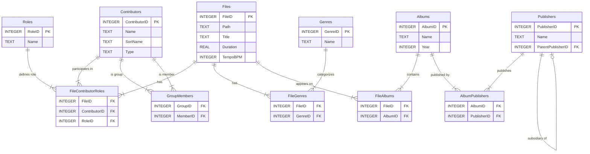

# Database Documentation

This document describes the SQLite database structure used by the Gosling2 application.

## Overview

- **Database Engine**: SQLite 3
- **File Location**: `sqldb/gosling2.sqlite3`
- **Foreign Keys**: Enabled (`PRAGMA foreign_keys = ON`)

## 🛡️ Schema Governance (Strict Mode)

This database schema is **Strictly Enforced** by the test suite. 
Any change to Tables or Columns (adding, removing, renaming) **MUST** be accompanied by updates to:
1.  `src/completeness_criteria.json`
2.  `Song` Model (`src/data/models/song.py`)
3.  `SongRepository` Whitelists
4.  UI and Service components

**Do not manually modify the schema** without running `pytest` to identify all 9 layers of broken dependencies. The system is designed to "yell" at you if you simply `ALTER TABLE` without updating the code.

## Schema Diagram



## Tables

### 1. `Files`
Stores information about each music file in the library.

| Column | Type | Constraints | Description |
|--------|------|-------------|-------------|
| `FileID` | INTEGER | PRIMARY KEY | Unique identifier for the file |
| `Path` | TEXT | NOT NULL UNIQUE | Absolute file path |
| `Title` | TEXT | NOT NULL | Track title (from metadata or filename) |
| `Duration` | REAL | - | Duration in seconds |
| `TempoBPM` | INTEGER | - | Beats per minute |
| `RecordingYear` | INTEGER | - | Year of recording |
| `ISRC` | TEXT | - | International Standard Recording Code |
| `IsDone` | BOOLEAN | - | Status flag (Processed/Not Processed) |
| `Album` | TEXT | - | Album Name (Planned) - Deprecated, use `FileAlbums` |

**Note:** 
- Genre is stored via the `FileGenres` junction table for many-to-many relationships.
- Album is stored via the `FileAlbums` junction table (songs can appear on multiple albums).
- Publisher is linked to Albums (via `AlbumPublishers`), not directly to songs.

### 2. `Contributors`
Stores unique names of all people or groups involved in the music (artists, composers, etc.).

| Column | Type | Constraints | Description |
|--------|------|-------------|-------------|
| `ContributorID` | INTEGER | PRIMARY KEY | Unique identifier for the contributor |
| `Name` | TEXT | NOT NULL UNIQUE | Display name |
| `SortName` | TEXT | - | Name used for sorting (e.g., "Beatles, The") |
| `Type` | TEXT | CHECK(Type IN ('person', 'group')) | Contributor type: 'person' or 'group' |

**Type Column:**
- `'person'`: Individual contributor (e.g., "John Lennon")
- `'group'`: Band/ensemble (e.g., "The Beatles")
- Prevents circular group membership (groups can only contain persons)

### 3. `Roles`
Defines the types of participation a contributor can have.

| Column | Type | Constraints | Description |
|--------|------|-------------|-------------|
| `RoleID` | INTEGER | PRIMARY KEY | Unique identifier for the role |
| `Name` | TEXT | NOT NULL UNIQUE | Role name (e.g., "Performer", "Composer") |

**Default Roles:**
- Performer
- Composer
- Lyricist
- Producer

### 4. `FileContributorRoles` (Junction Table)
Links Files, Contributors, and Roles to represent "Who did what on which track".

| Column | Type | Constraints | Description |
|--------|------|-------------|-------------|
| `FileID` | INTEGER | FK, NOT NULL | Reference to `Files` |
| `ContributorID` | INTEGER | FK, NOT NULL | Reference to `Contributors` |
| `RoleID` | INTEGER | FK, NOT NULL | Reference to `Roles` |

**Constraints:**
- Primary Key: `(FileID, ContributorID, RoleID)`
- `ON DELETE CASCADE` for FileID and ContributorID

### 5. `GroupMembers` (Self-Reference Junction)
Represents relationships between contributors (e.g., a band and its members).

| Column | Type | Constraints | Description |
|--------|------|-------------|-------------|
| `GroupID` | INTEGER | FK, NOT NULL | ID of the group (from `Contributors`) |
| `MemberID` | INTEGER | FK, NOT NULL | ID of the member (from `Contributors`) |

**Constraints:**
- Primary Key: `(GroupID, MemberID)`

**Validation:**
- `GroupID` must reference a Contributor with Type='group'
- `MemberID` must reference a Contributor with Type='person'
- Prevents circular group membership

### 6. `Genres`
Stores the master list of music genres.

| Column | Type | Constraints | Description |
|--------|------|-------------|-------------|
| `GenreID` | INTEGER | PRIMARY KEY | Unique identifier for the genre |
| `Name` | TEXT | NOT NULL UNIQUE | Genre name (e.g., "House", "Electronic", "Dance") |

**Notes:**
- Genres are auto-created when user enters a new genre name
- **Normalization:** Names stored in title case ("House", "Hip Hop") to prevent duplicates
- Case-sensitive uniqueness enforced

### 7. `FileGenres` (Junction Table)
Links Files to Genres in a many-to-many relationship (a song can have multiple genres).

| Column | Type | Constraints | Description |
|--------|------|-------------|-------------|
| `FileID` | INTEGER | FK, NOT NULL | Reference to `Files` |
| `GenreID` | INTEGER | FK, NOT NULL | Reference to `Genres` |

**Constraints:**
- Primary Key: `(FileID, GenreID)`
- `ON DELETE CASCADE` for FileID

**UI Representation:**
- Displayed as comma-separated string in table view: "House, Electronic, Dance"
- Edited via tag-style input with autocomplete
- Stored as normalized many-to-many relationships

### 8. `Publishers`
Stores music publishers/labels with hierarchical relationships (subsidiaries, acquisitions).

| Column | Type | Constraints | Description |
|--------|------|-------------|-------------|
| `PublisherID` | INTEGER | PRIMARY KEY | Unique identifier for the publisher |
| `Name` | TEXT | NOT NULL UNIQUE | Publisher name (e.g., "Yugoton", "Croatia Records") |
| `ParentPublisherID` | INTEGER | FK (self-reference) | Reference to parent publisher (for subsidiaries) |

**Hierarchical Structure:**
- Self-referencing foreign key enables unlimited hierarchy depth
- Example: Def Jam → Island Records → Universal Music Group
- `ParentPublisherID = NULL` indicates top-level publisher

**Example Data:**
```
PublisherID | Name                    | ParentPublisherID
1           | Universal Music Group   | NULL
2           | Island Records          | 1
3           | Def Jam Recordings      | 2
4           | Croatia Records         | NULL
5           | Yugoton                 | 4
```

**UI Representation:**
- **Table View:** Shows full hierarchy chain: "Yugoton, Croatia Records"
- **Filter Tree:** Flat alphabetical list with search, tooltip shows parent
- **Search:** Searching "Croatia Records" includes all subsidiary songs (Yugoton)

**Query Pattern (Recursive CTE):**
```sql
-- Find all publishers under "Universal Music Group" (including descendants)
WITH RECURSIVE publisher_tree AS (
  SELECT PublisherID FROM Publishers WHERE Name = 'Universal Music Group'
  UNION
  SELECT p.PublisherID FROM Publishers p
  JOIN publisher_tree pt ON p.ParentPublisherID = pt.PublisherID
)
SELECT * FROM Files WHERE PublisherID IN (SELECT PublisherID FROM publisher_tree);
```

### 9. `Albums`
Stores album information. Songs can appear on multiple albums (original release, compilations, re-releases).

| Column | Type | Constraints | Description |
|--------|------|-------------|-------------|
| `AlbumID` | INTEGER | PRIMARY KEY | Unique identifier for the album |
| `Name` | TEXT | NOT NULL | Album name (e.g., "Abbey Road", "1", "Hey Jude (Single)") |
| `Year` | INTEGER | - | Album release year |

**Notes:**
- Singles are treated as albums (e.g., "Hey Jude (Single)")
- Compilations and re-releases are separate albums with different years
- Publishers are linked to albums, not individual songs
- **Duplicate names allowed:** "Greatest Hits" can exist multiple times (different artists/years)
- **Year validation:** Application warns if Year < 1860 or Year > current_year + 1

**Example Data:**
```
AlbumID | Name                      | Year
1       | Hey Jude (Single)         | 1968
2       | The Beatles 1967-1970     | 1973
3       | 1                         | 2000
```

### 10. `AlbumPublishers` (Junction Table)
Links Albums to Publishers in a many-to-many relationship (an album can have multiple publishers).

| Column | Type | Constraints | Description |
|--------|------|-------------|-------------|
| `AlbumID` | INTEGER | FK, NOT NULL | Reference to `Albums` |
| `PublisherID` | INTEGER | FK, NOT NULL | Reference to `Publishers` |

**Constraints:**
- Primary Key: `(AlbumID, PublisherID)`
- `ON DELETE CASCADE` for AlbumID

**Use Cases:**
- Co-publishing agreements
- Territorial distribution deals
- Label acquisitions/mergers

### 11. `FileAlbums` (Junction Table)
Links Files (songs) to Albums in a many-to-many relationship.

| Column | Type | Constraints | Description |
|--------|------|-------------|-------------|
| `FileID` | INTEGER | FK, NOT NULL | Reference to `Files` |
| `AlbumID` | INTEGER | FK, NOT NULL | Reference to `Albums` |

**Constraints:**
- Primary Key: `(FileID, AlbumID)`
- `ON DELETE CASCADE` for FileID

**Example:**
```
Song: "Hey Jude" (FileID=101, RecordingYear=1968)
├─ Album: "Hey Jude (Single)" (AlbumID=1, Year=1968)
│  └─ Publisher: Apple Records
└─ Album: "1" (AlbumID=3, Year=2000)
   └─ Publishers: Apple Records, EMI

Table Display: 
- Albums: "Hey Jude (Single), 1"
- Publishers: "Apple Records, EMI" (aggregated from all albums)
```

**Year Filtering Note:**
- **Current Implementation:** Year filter uses `Files.RecordingYear` (original recording year)
- **Future Consideration:** May add option to filter by `Albums.Year` (album release year) to find songs on compilations
- **Example:** Filtering "2000" currently shows songs recorded in 2000, not songs appearing on 2000 albums


## Repositories

Database access is managed through the Repository pattern in `src/data/repositories/`:

- **`BaseRepository`**: Handles connection lifecycle and schema creation.
- **`SongRepository`**: Manages `Files` and related `FileContributorRoles`.
- **`ContributorRepository`**: Manages `Contributors` and `GroupMembers`.

## Usage Example

Relationship querying is typically handled via `JOIN` operations.

**Get all performers for a song:**
```sql
SELECT c.Name
FROM Contributors c
JOIN FileContributorRoles fcr ON c.ContributorID = fcr.ContributorID
JOIN Roles r ON fcr.RoleID = r.RoleID
WHERE fcr.FileID = ? AND r.Name = 'Performer'
```
