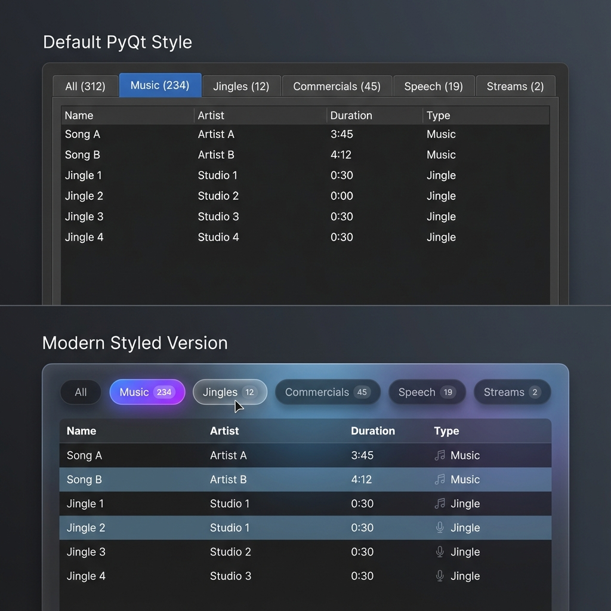

# UX Styling Proposal

**Status:** 🔮 Future  
**Depends On:** Core features implemented first

---

## Overview

This document tracks UI/UX styling decisions for modernizing Gosling2's interface beyond default PyQt styling.

---

## Current State

- Default PyQt6 widgets
- Dark theme (basic)
- No custom styling

---

## Planned Improvements

### Phase 1: Type Tabs (T-01)
Default Qt tabs for MVP, then upgrade to:
- Pill-shaped buttons with rounded corners
- Count badges
- Gradient selected state

### Phase 2: General Theme
- Consistent color palette
- Custom button styles
- Better typography (font choices)
- Alternating row colors in tables

### Phase 3: Advanced Components
- Cart Wall buttons (for Sweepers/SFX)
- Glass-morphism panels
- Micro-animations

---

## Layout Grid System (Space Allocation)

To ensure smooth transition, we reserve screen real estate for future components now:

| Zone | Element | Tech Status | Implementation Note |
|------|---------|-------------|---------------------|
| **Header** | Search Bar, Profile | Planned | Placeholder container at top |
| **Sub-Header** | **Type Tabs (T-01)** | Next (T-01) | Full width below header |
| **Left Sidebar** | **Filter Tree (T-23)** | Planned | `QDockWidget` or Splitter (Left) |
| **Center** | **Library Table** | Existing | `QTableView` (Central Widget) |
| **Right Panel** | **Side Panel (T-12)** | Planned | `QDockWidget` (Right, hidden by default) |
| **Footer** | Player, Queue | Existing | Fixed height container at bottom |

**Transition Strategy:**
- Build **Type Tabs** in Sub-Header immediately.
- Use placeholders or empty DockWidgets for **Left/Right panels**.
- Keep existing "Filter Combos" until Left Sidebar is ready.

---

## Color Palette (TBD)

| Role | Color | Notes |
|------|-------|-------|
| Primary | #6366F1 | Indigo/purple accent |
| Background | #1E1E2E | Dark base |
| Surface | #2A2A3C | Cards/panels |
| Text | #E4E4E7 | Primary text |
| Muted | #71717A | Secondary text |

---

## Open Questions

1. Should we use a Qt stylesheet framework (e.g., QDarkStyle)?
2. Custom fonts or system fonts?
3. Animation library for micro-interactions?

---

## Mockups

All AI-generated mockups stored in `design/mockups/`:
- [type_tabs_mockup.png](../mockups/type_tabs_mockup.png) — Comparison of default vs modern
- [qt_realistic_styling.png](../mockups/qt_realistic_styling.png) — Achievable with pure QSS (no blur)
- [gosling2_full_vision.png](../mockups/gosling2_full_vision.png) — Complete app vision

### Full App Vision

Complete application with:
- Type tabs, filter sidebar, library table
- Side panel editing, tag chips
- Player bar with playlist queue

### Realistic Qt Styling (No Blur)

This is achievable with:
- Qt Stylesheets (QSS)
- Gradients, shadows, rounded corners
- Hover effects (color shifts, subtle scale, glow)
- No platform-specific code required

---

*This proposal will be expanded as we implement features.*
