# Database Documentation

This document describes the SQLite database structure used by the Gosling2 application.

## Overview

- **Database Engine**: SQLite 3
- **File Location**: `sqldb/gosling2.db`
- **Foreign Keys**: Enabled (`PRAGMA foreign_keys = ON`)
- **Total Tables**: 30 (including junctions and lookups)

---

## 🔮 Planned Schema Changes

> **See:** [PROPOSAL_SCHEMA_V2.md](./PROPOSAL_SCHEMA_V2.md) and [PROPOSAL_IDENTITY_MODEL.md](./PROPOSAL_IDENTITY_MODEL.md)

### Immediate (Schema V2)

| Change | Table | Status |
|--------|-------|--------|
| Remove `AlbumArtist` TEXT column | `Albums` | 🔴 Pending |
| Add `RoleCategory`, `ShowInCredits`, `ShowInReport` | `Roles` | 🔴 Pending |
| Add partial unique index for single primary album | `SongAlbums` | 🔴 Pending |
| Create `TagCategories` table | NEW | 🔴 Pending |

### Future (Identity Model)

| Change | Current Table | New Table | Status |
|--------|---------------|-----------|--------|
| Split Contributors into Identity + Name | `Contributors` | `Identities` + `ArtistNames` | 📋 Proposed |
| Replace credits with immutable Name references | `MediaSourceContributorRoles` | `SongCredits` | 📋 Proposed |
| Replace credits with immutable Name references | `AlbumContributors` | `AlbumCredits` | 📋 Proposed |
| Add temporal membership data | `GroupMembers` | `GroupMemberships` | 📋 Proposed |

### Publisher Clarification (Already Correct!)

The two publisher tables serve **different semantic purposes**:

| Table | Purpose | Example |
|-------|---------|---------|
| `RecordingPublishers` | Master recording owner | Northern Songs owns "Help" |
| `AlbumPublishers` | Release label for this album | Sony released the 2009 remaster |

These are NOT override/fallback — they're distinct relationships!

---

## 🛡️ Schema Governance (Strict Mode)

This database schema is **Strictly Enforced** by the test suite. 
Any change to Tables or Columns (adding, removing, renaming) **MUST** be accompanied by updates to:
1.  **Yellberus Registry** (`src/core/yellberus.py`)
2.  Models in `src/data/models/`
3.  Repository Queries in `src/data/repositories/`
4.  UI and Service components

**Do not manually modify the schema** without running `pytest` to identify all layers of broken dependencies. The system is designed to "yell" at you if you simply `ALTER TABLE` without updating the code.

> [!IMPORTANT]
> **Priority Rule:** The "10 Layers of Yell" validation steps (enforced by Yellberus) take priority over everything. You are strictly forbidden from adding columns to the database if they are not actively used by the application logic. **Dead schema elements are treated as bugs.**

## ✅ Completeness Criteria (IsDone Flag)

A song is considered "Done" if its `ProcessingStatus` column is `1`. 
Historically this was a calculated "Unprocessed" tag, but it is now a dedicated, indexed database column for performance and reliability.

### Mandatory Fields (All Types)
| Field | Requirement | Notes |
|-------|-------------|-------|
| `MediaName` | Not empty | From ID3 or filename |
| `SourcePath` | Not empty | File path or URL must be valid |
| `SourceDuration` | ≥ 30 seconds | Prevents stub files |

### Mandatory Tags (Songs Only)
| Category | Requirement |
|----------|-------------|
| Genre | At least 1 tag with `TagCategory = 'Genre'` |
| Language | At least 1 tag with `TagCategory = 'Language'` |
| Artist | At least 1 Contributor with Role = 'Performer' |

### Optional Fields
| Field | Notes |
|-------|-------|
| `TempoBPM` | Recommended for mixing |
| `ISRC` | International Standard Recording Code |
| `RecordingYear` | Original recording year |

> **Config location:** `src/core/yellberus.py`
> **Enforcement:** Validation service checks against Registry before setting IsDone


## Schema Diagrams

### 1. Target Architecture Schema (Future)

The following diagram represents the complete planned architecture.

```mermaid
erDiagram
    Types ||--|{ MediaSources : "categorizes"
    MediaSources ||--o| Songs : "extends"
    MediaSources ||--o| Streams : "extends"
    MediaSources ||--o| Commercials : "extends"
    MediaSources ||--|{ MediaSourceTags : "has"
    Tags ||--|{ MediaSourceTags : "applied to"
    Tags ||--o{ TagRelations : "parent of"
    Tags ||--o{ AutoTagRules : "applied by"
    MediaSources ||--|{ MediaSourceContributorRoles : "has"
    Contributors ||--|{ MediaSourceContributorRoles : "participates in"
    Contributors ||--|{ ContributorAliases : "known as"
    Roles ||--|{ MediaSourceContributorRoles : "defines role"
    Contributors ||--|{ GroupMembers : "is group"
    Contributors ||--|{ GroupMembers : "is member"
    MediaSourceContributorRoles }o--|| ContributorAliases : "credited as"
    
    %% MULTI-ALBUM INFRASTRUCTURE
    Songs ||--|{ SongAlbums : "appears on"
    Albums ||--|{ SongAlbums : "contains"
    Albums ||--|{ AlbumContributors : "has"
    Contributors ||--|{ AlbumContributors : "participates in"
    Roles ||--|{ AlbumContributors : "defines role"
    Songs ||--|{ RecordingPublishers : "owned by (Master)"
    Publishers ||--|{ RecordingPublishers : "owns"
    Albums ||--|{ AlbumPublishers : "published by (Release)"
    Publishers ||--|{ AlbumPublishers : "publishes"
    SongAlbums }|--o| Publishers : "licensed via (Track Override)"

    Commercials ||--o| Campaigns : "belongs to"
    Campaigns ||--o| Clients : "belongs to"
    Clients ||--o| Agencies : "represented by"
    Playlists ||--|{ PlaylistItems : "contains"
    MediaSources ||--|{ PlaylistItems : "appears in"
    MediaSources ||--o{ PlayHistory : "played as"
    MediaSources ||--o{ ChangeLog : "edited in"
    MediaSources ||--o{ ActionLog : "acted on"
    MediaSources ||--o{ DeletedRecords : "archived in"

    Types {
        INTEGER TypeID PK
        TEXT TypeName
    }

    MediaSources {
        INTEGER SourceID PK
        INTEGER TypeID FK
        TEXT MediaName
        TEXT SourcePath
        REAL SourceDuration
        TEXT AudioHash
        TEXT SourceNotes
        BOOLEAN IsActive
    }

    Songs {
        INTEGER SourceID PK
        INTEGER TempoBPM
        INTEGER RecordingYear
        TEXT ISRC
        TEXT SongGroups

        REAL CueIn
        REAL CueOut
        REAL Intro
        REAL Outro
        REAL HookIn
        REAL HookOut
        TEXT MusicBrainzRecordingID "RESERVED v0.3"
    }

    Streams {
        INTEGER SourceID PK
        TEXT FailoverURL
        TEXT StreamFormat
    }

    Commercials {
        INTEGER SourceID PK
        INTEGER CampaignID FK
    }

    Tags {
        INTEGER TagID PK
        TEXT TagName
        TEXT TagCategory
    }

    MediaSourceTags {
        INTEGER SourceID FK
        INTEGER TagID FK
    }

    TagRelations {
        INTEGER ParentTagID FK
        INTEGER ChildTagID FK
    }

    AutoTagRules {
        INTEGER RuleID PK
        INTEGER TargetTagID FK
        TEXT AutoTagRuleType
        TEXT RuleFieldName
        TEXT Operator
        TEXT Value1
        TEXT Value2
        INTEGER SourceTagID FK
        INTEGER ContributorID FK
    }

    Contributors {
        INTEGER ContributorID PK
        TEXT ContributorName
        TEXT SortName
        TEXT ContributorType "person/group"
    }

    ContributorAliases {
        INTEGER AliasID PK
        INTEGER ContributorID FK
        TEXT AliasName
    }

    Roles {
        INTEGER RoleID PK
        TEXT RoleName
        TEXT RoleCategory "🔮 PLANNED: primary/featured/composition/production"
        BOOLEAN ShowInCredits "🔮 PLANNED"
        BOOLEAN ShowInReport "🔮 PLANNED"
        INTEGER DisplayOrder "🔮 PLANNED"
    }

    Albums {
        INTEGER AlbumID PK
        TEXT AlbumTitle
        TEXT AlbumArtist "⚠️ DEPRECATED - Use AlbumContributors M2M"
        TEXT AlbumType
        INTEGER ReleaseYear
        TEXT CatalogNumber "RESERVED v0.3"
        TEXT MusicBrainzReleaseID "RESERVED v0.3"
    }

    Playlists {
        INTEGER PlaylistID PK
        TEXT PlaylistName
        TEXT PlaylistDescription
        DATETIME CreatedAt
        DATETIME UpdatedAt
    }

    PlayHistory {
        INTEGER PlayID PK
        INTEGER SourceID FK
        INTEGER TypeID
        DATETIME PlayedAt
        REAL PlayDuration
        TEXT PlayEndedBy
        TEXT SnapshotMediaName
        TEXT SnapshotPerformer
        TEXT SnapshotPublisher
        TEXT SnapshotTags
    }

    ChangeLog {
        INTEGER LogID PK
        TEXT LogTableName
        INTEGER RecordID
        TEXT LogFieldName
        TEXT OldValue
        TEXT NewValue
        DATETIME LogTimestamp
        TEXT BatchID
    }

    DeletedRecords {
        INTEGER DeleteID PK
        TEXT DeletedFromTable
        INTEGER RecordID
        TEXT FullSnapshot
        DATETIME DeletedAt
        DATETIME RestoredAt
        TEXT BatchID
    }

    ActionLog {
        INTEGER ActionID PK
        TEXT ActionLogType
        TEXT TargetTable
        INTEGER ActionTargetID
        TEXT ActionDetails
        DATETIME ActionTimestamp
        TEXT UserID
    }

    MediaSourceContributorRoles {
        INTEGER SourceID PK
        INTEGER ContributorID PK
        INTEGER RoleID PK
        INTEGER CreditedAliasID FK "Nullable: If set, overrides display name"
    }

    GroupMembers {
        INTEGER GroupID PK
        INTEGER MemberID PK
    }
    
    AlbumContributors {
        INTEGER AlbumID PK
        INTEGER ContributorID PK
        INTEGER RoleID PK
    }

    SongAlbums {
        INTEGER SourceID PK
        INTEGER AlbumID PK
        INTEGER TrackNumber
        INTEGER DiscNumber
        BOOLEAN IsPrimary
        INTEGER TrackPublisherID FK
    }

    RecordingPublishers {
        INTEGER SourceID PK
        INTEGER PublisherID PK
    }

    AlbumPublishers {
        INTEGER AlbumID PK
        INTEGER PublisherID PK
    }

    Publishers {
        INTEGER PublisherID PK
        TEXT PublisherName
        INTEGER ParentPublisherID FK
    }

    PlaylistItems {
        INTEGER PlaylistItemID PK
        INTEGER PlaylistID FK
        INTEGER SourceID FK
        INTEGER PlaylistItemPosition
    }

    Agencies {
        INTEGER AgencyID PK
        TEXT AgencyName
        TEXT AgencyContactName
        TEXT AgencyContactEmail
        TEXT AgencyContactPhone
    }

    Clients {
        INTEGER ClientID PK
        INTEGER AgencyID FK
        TEXT ClientName
        TEXT ClientContactName
        TEXT ClientContactEmail
        TEXT ClientContactPhone
        TEXT ClientNotes
    }

    Campaigns {
        INTEGER CampaignID PK
        INTEGER ClientID FK
        TEXT CampaignName
        DATE StartDate
        DATE EndDate
        INTEGER RequestedPlays
        TEXT ScheduleNotes
        TEXT CampaignNotes
    }

    Timeslots {
        INTEGER TimeslotID PK
        TEXT TimeslotName
        TEXT StartTime
        TEXT EndTime
        TEXT DaysOfWeek
        INTEGER Priority
        BOOLEAN IsDefault
    }

    ContentRules {
        INTEGER RuleID PK
        INTEGER TimeslotID FK
        INTEGER ContentRulePosition
        TEXT ContentType
        TEXT RuleFilterCriteria
        INTEGER LoopTo
    }

    EntityTimeline {
        TEXT EventType
        INTEGER SourceID
        TEXT Summary
        DATETIME EventTimestamp
    }

    Timeslots ||--|{ ContentRules : "defines"
```



> **Implementation Status Overview:**
> - ✅ **Implemented (14 Tables):** Types, MediaSources, Songs, Contributors, Roles, MediaSourceContributorRoles, GroupMembers, ContributorAliases, Albums, SongAlbums, Publishers, AlbumPublishers, RecordingPublishers, AlbumContributors
> - ❌ **Not Implemented (Missing):** Streams, Commercials, Tags, MediaSourceTags, TagRelations, AutoTagRules, Playlists, PlaylistItems, Agencies, Clients, Campaigns
> - ⏸️ **Planned (Audit):** ChangeLog, DeletedRecords, PlayHistory, ActionLog
> - 🔮 **Future (Broadcast):** Timeslots, ContentRules

---

## Core Tables

### 1. `Types` (Lookup) ✅ Implemented

Defines the content type for each media source.

| Column | Type | Constraints | Description |
|--------|------|-------------|-------------|
| `TypeID` | INTEGER | PRIMARY KEY | Unique identifier |
| `TypeName` | TEXT | NOT NULL UNIQUE | Type name |

**Default Types:**
| TypeID | TypeName | Description |
|--------|----------|-------------|
| 1 | Song | Music tracks |
| 2 | Jingle | Station identifiers |
| 3 | Commercial | Advertisements |
| 4 | VoiceTrack | Pre-recorded voice segments |
| 5 | Recording | Shows, interviews, reruns |
| 6 | Stream | Live audio feeds |

### 2. `MediaSources` (Base Table) ✅ Implemented

The base table for all playable content. Every audio item starts here.

| Column | Type | Constraints | Description |
|--------|------|-------------|-------------|
| `SourceID` | INTEGER | PRIMARY KEY | Unique identifier |
| `TypeID` | INTEGER | FK NOT NULL | Reference to `Types` |
| `MediaName` | TEXT | NOT NULL | Display name (from ID3 or filename) |
| `SourceNotes` | TEXT | - | Searchable description |
| `SourcePath` | TEXT | NOT NULL | File path (C:\...) or URL (https://...) |
| `SourceDuration` | REAL | - | Duration in seconds (NULL for streams) |
| `AudioHash` | TEXT | INDEXED | Hash of MP3 audio frames only (excludes ID3 tags) for duplicate detection |
| `IsActive` | BOOLEAN | DEFAULT 1 | Show in library (0 = hidden/inactive) |
| `ProcessingStatus` | INTEGER | DEFAULT 1 | 0 = Unprocessed, 1 = Done (Workflow State) |

**Notes:**
- `Source` field holds either a local file path or stream URL
- `IsActive = 0` hides the item from library without deleting
- `ProcessingStatus`: Core workflow state. Replaces legacy "Unprocessed" tag.
- Use for seasonal content, expired ads, or soft-delete
- `AudioHash` is calculated from MP3 audio data only (ID3v2 header and ID3v1 footer are excluded) to detect duplicates even when metadata differs

### 3. `Songs` (Music-Specific) ✅ Implemented

Extends `MediaSources` for music tracks with additional metadata and timing.

| Column | Type | Constraints | Description |
|--------|------|-------------|-------------|
| `SourceID` | INTEGER | PK, FK | Reference to `MediaSources` |
| `TempoBPM` | INTEGER | - | Beats per minute |
| `RecordingYear` | INTEGER | - | Original recording year |
| `ISRC` | TEXT | - | International Standard Recording Code |
| `SongGroups` | TEXT | - | Content group description (TIT1) |

| `CueIn` | REAL | DEFAULT 0 | ❌ Playback start trim (seconds) |
| `CueOut` | REAL | - | ❌ Playback end trim (seconds) |
| `Intro` | REAL | - | ❌ End of talk-over zone at start |
| `Outro` | REAL | - | ❌ Start of talk-over zone at end |
| `HookIn` | REAL | - | ❌ Teaser segment start |
| `HookOut` | REAL | - | ❌ Teaser segment end |
| `MusicBrainzRecordingID` | TEXT | - | 🔮 (v0.3) Unique Recording ID |

**Timing Fields:**
```
|<--CueIn--|=====INTRO=====|-------BODY-------|=====OUTRO=====|--CueOut-->|
           ^               ^                   ^               ^
           0:02            0:15                3:30            3:45
           
|---HOOK---|
^          ^
1:00       1:10
```


**Constraints:**
- `ON DELETE CASCADE` from `MediaSources`

### 4. `RecordingPublishers` ✅ Implemented (v0.2)
Links songs to their primary master owners (ISRC owners).

| Column | Type | Constraints | Description |
|--------|------|-------------|-------------|
| `SourceID` | INTEGER | PK, FK | Reference to `Songs` |
| `PublisherID` | INTEGER | PK, FK | Reference to `Publishers` |

**Constraints:**
- Primary Key: `(SourceID, PublisherID)`
- `ON DELETE CASCADE` for both FKs

### 5. `Albums` ✅ Implemented

Groups songs into collections.

| Column | Type | Constraints | Description |
|--------|------|-------------|-------------|
| `AlbumID` | INTEGER | PRIMARY KEY | Unique identifier |
| `AlbumTitle` | TEXT | NOT NULL | Album title |
| `AlbumArtist` | TEXT | - | **Legacy field.** Joined artist names (for backward compatibility). |
| `AlbumType` | TEXT | - | 'Album', 'Single', 'EP', 'Compilation' |
| `ReleaseYear` | INTEGER | - | Release year |
| `CatalogNumber` | TEXT | - | 🔮 (v0.3) Label catalog number |
| `MusicBrainzReleaseID` | TEXT | - | 🔮 (v0.3) Unique Release ID |

**M2M Migration (v0.2):**
- Primary artist links moved to `AlbumContributors`.
- `AlbumArtist` remains as a joined text field for quick display and legacy disambiguation.

### 6. `AlbumContributors` (Junction) ✅ Implemented
Links albums to contributors with roles (e.g., Album Artist).

| Column | Type | Constraints | Description |
|--------|------|-------------|-------------|
| `AlbumID` | INTEGER | FK NOT NULL | Reference to `Albums` |
| `ContributorID` | INTEGER | FK NOT NULL | Reference to `Contributors` |
| `RoleID` | INTEGER | FK NOT NULL | Reference to `Roles` |

**Constraints:**
- Primary Key: `(AlbumID, ContributorID, RoleID)`
- `ON DELETE CASCADE` for AlbumID and ContributorID.

**Uniqueness Constraint:**
- `UNIQUE(Title, AlbumArtist, ReleaseYear)` — Prevents "Greatest Hits" paradox where Queen and ABBA albums merge.
- If `AlbumArtist` is NULL (e.g., compilations), uniqueness falls back to `(Title, ReleaseYear)`.

**ID3 Mapping:**
- `AlbumArtist` ← `TPE2` (Album Artist frame)
- Fallback: `TPE1` (Lead artist) if `TPE2` is empty
- For compilations: "Various Artists" or similar

**Lifecycle Rules:**
- **Orphan Policy:** Empty albums (0 songs) are **NOT** automatically deleted. They persist to preserve metadata.
- **Cleanup:** User must be prompted to delete empty albums via the UI.

### 7. `Streams` (Remote Audio) ❌ Not Implemented

Extends `MediaSources` for live audio streams.

| Column | Type | Constraints | Description |
|--------|------|-------------|-------------|
| `SourceID` | INTEGER | PK, FK | Reference to `MediaSources` |
| `FailoverURL` | TEXT | - | Backup stream URL |
| `StreamFormat` | TEXT | - | 'MP3', 'AAC', 'FLAC' |

**Constraints:**
- `ON DELETE CASCADE` from `MediaSources`

### 8. `Commercials` (Ad-Specific) ❌ Not Implemented

Extends `MediaSources` for advertisements with campaign linking.

| Column | Type | Constraints | Description |
|--------|------|-------------|-------------|
| `SourceID` | INTEGER | PK, FK | Reference to `MediaSources` |
| `CampaignID` | INTEGER | FK | Reference to `Campaigns` |

**Constraints:**
- `ON DELETE CASCADE` from `MediaSources`
- `ON DELETE SET NULL` for `CampaignID`

---

## Business Tables

### 8. `Agencies` ❌ Not Implemented

Advertising agencies that represent clients.

| Column | Type | Constraints | Description |
|--------|------|-------------|-------------|
| `AgencyID` | INTEGER | PRIMARY KEY | Unique identifier |
| `AgencyName` | TEXT | NOT NULL UNIQUE | Agency name |
| `AgencyContactName` | TEXT | - | Primary contact person |
| `AgencyContactEmail` | TEXT | - | Contact email |
| `AgencyContactPhone` | TEXT | - | Contact phone |

### 9. `Clients` ❌ Not Implemented

Advertisers who commission commercials.

| Column | Type | Constraints | Description |
|--------|------|-------------|-------------|
| `ClientID` | INTEGER | PRIMARY KEY | Unique identifier |
| `AgencyID` | INTEGER | FK | Reference to `Agencies` |
| `ClientName` | TEXT | NOT NULL UNIQUE | Client/brand name |
| `ClientContactName` | TEXT | - | Primary contact person |
| `ClientContactEmail` | TEXT | - | Contact email |
| `ClientContactPhone` | TEXT | - | Contact phone |
| `ClientNotes` | TEXT | - | Additional notes |

**Constraints:**
- `ON DELETE SET NULL` for `AgencyID`

### 10. `Campaigns` ❌ Not Implemented

Advertising campaigns with scheduling information.

| Column | Type | Constraints | Description |
|--------|------|-------------|-------------|
| `CampaignID` | INTEGER | PRIMARY KEY | Unique identifier |
| `ClientID` | INTEGER | FK NOT NULL | Reference to `Clients` |
| `CampaignName` | TEXT | NOT NULL | Campaign name |
| `StartDate` | DATE | - | Campaign start date |
| `EndDate` | DATE | - | Campaign end date |
| `RequestedPlays` | INTEGER | - | Total plays requested |
| `ScheduleNotes` | TEXT | - | Scheduling requirements (e.g., "3x morning, 2x evening") |
| `CampaignNotes` | TEXT | - | Additional notes |

**Constraints:**
- `ON DELETE CASCADE` from `Clients`

---

## Tags System (Unified)

All categorization (Genre, Language, Mood, custom) uses the Tags system.

### 11. `Tags` ❌ Not Implemented

Master list of all tags with optional category grouping.

| Column | Type | Constraints | Description |
|--------|------|-------------|-------------|
| `TagID` | INTEGER | PRIMARY KEY | Unique identifier |
| `TagName` | TEXT | NOT NULL | Tag display name |
| `TagCategory` | TEXT | - | 'Genre', 'Language', 'Mood', 'Usage', or NULL for custom |

**Constraints:**
- `UNIQUE(TagName, TagCategory)` — Same name can exist in different categories

**Built-in Categories:**
| Category | Examples | Mandatory |
|----------|----------|-----------|
| Genre | Rock, Pop, Jazz, House | Yes (Songs) |
| Language | English, Croatian, Instrumental | Yes (Songs) |
| Mood | Upbeat, Mellow, Chill | No |
| Usage | Morning, Ad-break, Event | No |
| *(NULL)* | Custom user tags | No |

### 12. `MediaSourceTags` (Junction) ❌ Not Implemented

Links media sources to tags.

| Column | Type | Constraints | Description |
|--------|------|-------------|-------------|
| `SourceID` | INTEGER | FK NOT NULL | Reference to `MediaSources` |
| `TagID` | INTEGER | FK NOT NULL | Reference to `Tags` |

**Constraints:**
- Primary Key: `(SourceID, TagID)`
- `ON DELETE CASCADE` for both FKs

### 13. `TagRelations` ❌ Not Implemented

Hierarchical tag relationships for smart searching.

| Column | Type | Constraints | Description |
|--------|------|-------------|-------------|
| `ParentTagID` | INTEGER | FK NOT NULL | Parent tag |
| `ChildTagID` | INTEGER | FK NOT NULL | Child tag |

**Constraints:**
- Primary Key: `(ParentTagID, ChildTagID)`
- `ON DELETE CASCADE` for both FKs

**Use Cases:**
- `1980s` → `1987` (decade contains year)
- `Rock` → `Classic Rock` → `80s Rock` (genre hierarchy)
- Searching parent finds all children

### 14. `AutoTagRules` ❌ Not Implemented

Automatic tag application based on conditions.

| Column | Type | Constraints | Description |
|--------|------|-------------|-------------|
| `RuleID` | INTEGER | PRIMARY KEY | Unique identifier |
| `TargetTagID` | INTEGER | FK NOT NULL | Tag to apply when rule matches |
| `AutoTagRuleType` | TEXT | NOT NULL | 'FIELD', 'TAG', or 'CONTRIBUTOR' |
| `RuleFieldName` | TEXT | - | For FIELD rules: 'RecordingYear', 'TempoBPM', etc. |
| `Operator` | TEXT | - | 'BETWEEN', '=', '<', '>', 'LIKE' |
| `Value1` | TEXT | - | First comparison value |
| `Value2` | TEXT | - | Second value (for BETWEEN) |
| `SourceTagID` | INTEGER | FK | For TAG rules: if has this tag |
| `ContributorID` | INTEGER | FK | For CONTRIBUTOR rules: if has this artist |

**Rule Examples:**
| Rule | Effect |
|------|--------|
| FIELD: RecordingYear BETWEEN 1960-1969 | → Tag "1960s" |
| FIELD: TempoBPM > 120 | → Tag "Upbeat" |
| CONTRIBUTOR: The Beatles | → Tag "Oldies" |
| TAG: Rock | → Tag "Music" |

**Implementation Notes:**
- **Execution order:** FIELD rules → TAG rules → CONTRIBUTOR rules
- **Cascading:** Rules can trigger other rules (intentional design)
- **Cycle detection:** App must detect and break infinite loops
- **Rule visualization:** UI should show rule graph (future feature)

---

## Playlists

### 15. `Playlists` ❌ Not Implemented

Saved playlists/queues.

| Column | Type | Constraints | Description |
|--------|------|-------------|-------------|
| `PlaylistID` | INTEGER | PRIMARY KEY | Unique identifier |
| `PlaylistName` | TEXT | NOT NULL | Playlist name |
| `PlaylistDescription` | TEXT | - | Optional description |
| `CreatedAt` | DATETIME | DEFAULT CURRENT_TIMESTAMP | Creation time |
| `UpdatedAt` | DATETIME | DEFAULT CURRENT_TIMESTAMP | Last modification |

### 16. `PlaylistItems` (Junction) ❌ Not Implemented

Links media sources to playlists with ordering.

| Column | Type | Constraints | Description |
|--------|------|-------------|-------------|
| `PlaylistItemID` | INTEGER | PRIMARY KEY | Unique identifier |
| `PlaylistID` | INTEGER | FK NOT NULL | Reference to `Playlists` |
| `SourceID` | INTEGER | FK NOT NULL | Reference to `MediaSources` |
| `PlaylistItemPosition` | INTEGER | NOT NULL | Order in playlist (1-based) |

**Constraints:**
- `ON DELETE CASCADE` for both FKs

---

## Audit & Recovery

### 17. `ChangeLog` ⏸️ Planned (Audit)

Transaction log for undo/audit functionality.

| Column | Type | Constraints | Description |
|--------|------|-------------|-------------|
| `LogID` | INTEGER | PRIMARY KEY | Unique identifier |
| `LogTableName` | TEXT | NOT NULL | Affected table |
| `RecordID` | INTEGER | NOT NULL | Affected record ID |
| `LogFieldName` | TEXT | NOT NULL | Changed field |
| `OldValue` | TEXT | - | Value before change |
| `NewValue` | TEXT | - | Value after change |
| `LogTimestamp` | DATETIME | DEFAULT CURRENT_TIMESTAMP | When changed |
| `BatchID` | TEXT | - | Groups related changes |

### 18. `DeletedRecords` ⏸️ Planned (Audit)

Snapshots of deleted records for recovery.

| Column | Type | Constraints | Description |
|--------|------|-------------|-------------|
| `DeleteID` | INTEGER | PRIMARY KEY | Unique identifier |
| `DeletedFromTable` | TEXT | NOT NULL | Deleted from table |
| `RecordID` | INTEGER | NOT NULL | Original record ID |
| `FullSnapshot` | TEXT | NOT NULL | JSON of record + related data |
| `DeletedAt` | DATETIME | DEFAULT CURRENT_TIMESTAMP | Deletion time |
| `RestoredAt` | DATETIME | - | NULL until restored |
| `BatchID` | TEXT | - | Groups cascaded deletes |

### 19. `PlayHistory` (As-Run Log) ⏸️ Planned (Audit)

Broadcast log tracking what played and when. **Snapshots metadata** at play time for backward-compatible exports (deleted songs remain queryable).

| Column | Type | Constraints | Description |
|--------|------|-------------|-------------|
| `PlayID` | INTEGER | PRIMARY KEY | Unique identifier |
| `SourceID` | INTEGER | FK | Reference to `MediaSources` (NULL if deleted) |
| `TypeID` | INTEGER | NOT NULL | Content type at time of play |
| `PlayedAt` | DATETIME | NOT NULL | When playback started |
| `PlayDuration` | REAL | - | Actual play duration (may differ from file) |
| `PlayEndedBy` | TEXT | - | 'natural', 'fade', 'stop', 'crash' |
| `SnapshotMediaName` | TEXT | NOT NULL | Title/Name at time of play |
| `SnapshotPerformer` | TEXT | - | Performer(s) at time of play |
| `SnapshotPublisher` | TEXT | - | Publisher at time of play |
| `SnapshotTags` | TEXT | - | JSON array of tags (Genre, Language) |

**Design Notes:**
- `SourceID` is a soft FK — points to MediaSources if still exists, NULL if deleted
- `Snapshot*` fields preserve metadata at play time for historical accuracy
- Query by date range, type, tags for As-Run reports
- Export service can split by day, filter by type, select columns

**Use Cases:**
```sql
-- All jingles last Monday
SELECT * FROM PlayHistory 
WHERE TypeID = 2 
  AND PlayedAt BETWEEN '2024-12-16' AND '2024-12-17';

-- All Croatian songs in last 3 years (including deleted)
SELECT SnapshotName, SnapshotPerformer, PlayedAt 
FROM PlayHistory 
WHERE TypeID = 1 
  AND SnapshotTags LIKE '%Croatian%'
  AND PlayedAt > datetime('now', '-3 years');
```

### 20. `ActionLog` (User Actions) ⏸️ Planned (Audit)

Tracks user actions for audit trail (who changed the playlist, imported files, etc.).

| Column | Type | Constraints | Description |
|--------|------|-------------|-------------|
| `ActionID` | INTEGER | PRIMARY KEY | Unique identifier |
| `ActionLogType` | TEXT | NOT NULL | 'PLAYLIST_ADD', 'PLAYLIST_MOVE', 'IMPORT', 'DELETE', etc. |
| `TargetTable` | TEXT | - | Affected table ('PlaylistItems', 'MediaSources') |
| `ActionTargetID` | INTEGER | - | Affected record ID |
| `ActionDetails` | TEXT | - | JSON with action-specific data |
| `ActionTimestamp` | DATETIME | DEFAULT CURRENT_TIMESTAMP | When action occurred |
| `UserID` | TEXT | - | User identifier (for multi-user future) |

**Action Types:**
- `PLAYLIST_ADD` / `PLAYLIST_REMOVE` / `PLAYLIST_MOVE`
- `IMPORT_FILE` / `DELETE_FILE`
- `PLAYBACK_START` / `PLAYBACK_STOP` (manual actions)
- `MARK_DONE` / `MARK_UNDONE`

### `EntityTimeline` (VIEW)
Unified view combining all activity for a single entity. Read-only VIEW, not a table.

```sql
CREATE VIEW EntityTimeline AS
  SELECT 'EDIT' AS EventType, RecordID AS SourceID, 
         LogFieldName || ': ' || OldValue || ' → ' || NewValue AS Summary, 
         LogTimestamp AS EventTimestamp
  FROM ChangeLog WHERE LogTableName = 'MediaSources'
  UNION ALL
  SELECT 'PLAY' AS EventType, SourceID, 
         'Played' AS Summary, 
         PlayedAt AS EventTimestamp
  FROM PlayHistory
  UNION ALL
  SELECT ActionLogType AS EventType, ActionTargetID AS SourceID, 
         ActionDetails AS Summary, 
         ActionTimestamp AS EventTimestamp
  FROM ActionLog WHERE TargetTable = 'MediaSources';
```

**Use Case:** View full history for "Hey Jude":
```sql
SELECT * FROM EntityTimeline WHERE SourceID = 123 ORDER BY Timestamp DESC;
```

---

## Contributors & Albums

### 21. `Contributors` ✅ Implemented

> **🔮 Future Change:** See [PROPOSAL_IDENTITY_MODEL.md](./PROPOSAL_IDENTITY_MODEL.md)  
> This table will be split into `Identities` (the person/group) and `ArtistNames` (names they use).

Artists, composers, and other credited individuals or groups.

| Column | Type | Constraints | Description |
|--------|------|-------------|-------------|
| `ContributorID` | INTEGER | PRIMARY KEY | Unique identifier |
| `ContributorName` | TEXT | NOT NULL UNIQUE | Display name |
| `SortName` | TEXT | - | Sorting name (e.g., "Beatles, The") |
| `ContributorType` | TEXT | CHECK(ContributorType IN ('person', 'group')) | Individual or band |

**Type Definitions:**
- `'person'`: An individual human being (e.g., "Dave Grohl").
- `'group'`: A collective entity (e.g., "Nirvana").
- *Note:* This distinction governs the `GroupMembers` logic. A 'group' has members; a 'person' does not.

**UI Implementation Requirements:**
- When creating a new Contributor (e.g., during "Add Artist"), the UI MUST provide a selector for Type.
- Default should be `'person'` for single names, or heuristics can suggest `'group'` if plural/known.
- **Strictness**: The database will reject `unknown` types. `field_editor.py` or importers must handle defaulting to `person` if unsure.

### 22. `ContributorAliases` ✅ Implemented

Alternative names for contributors (for search).

| Column | Type | Constraints | Description |
|--------|------|-------------|-------------|
| `AliasID` | INTEGER | PRIMARY KEY | Unique identifier |
| `ContributorID` | INTEGER | FK NOT NULL | Reference to `Contributors` |
| `AliasName` | TEXT | NOT NULL | Alternative name |

**Example:**
```
ContributorID=42, Name="P!nk"
Aliases: "Pink", "Alecia Moore", "Alecia Beth Moore"
```

**Search Strategy (Identity Resolution):**
1.  **Resolve**: Search for "Moore" → Finds ContributorID=42.
2.  **Expand**: Retrieve all identities for ID 42: `['P!nk', 'Pink', 'Alecia Moore', 'Alecia Beth Moore']`.
3.  **Query**: Select songs where `Performer` IN (list of identities).
    *   *Note: This avoids multiple self-joins in the main library query.*

**Constraints:**
- `ON DELETE CASCADE` from `Contributors`

### 23. `Roles` ✅ Implemented

Types of participation (Performer, Composer, etc.).

| Column | Type | Constraints | Description |
|--------|------|-------------|-------------|
| `RoleID` | INTEGER | PRIMARY KEY | Unique identifier |
| `RoleName` | TEXT | NOT NULL UNIQUE | Role name |
| `RoleCategory` | TEXT | 🔮 PLANNED | Category: 'primary', 'featured', 'composition', 'production' |
| `ShowInCredits` | BOOLEAN | 🔮 PLANNED | Show in song/album credit display |
| `ShowInReport` | BOOLEAN | 🔮 PLANNED | Include in royalty reports |
| `DisplayOrder` | INTEGER | 🔮 PLANNED | Sort order for UI display |

**Default Roles:**
- Performer (category: primary)
- Featuring (category: featured) 🔮 PLANNED
- Composer (category: composition)
- Lyricist (category: composition)
- Producer (category: production)

### 24. `MediaSourceContributorRoles` (Junction) ✅ Implemented

Links media sources to contributors with roles.

| Column | Type | Constraints | Description |
|--------|------|-------------|-------------|
| `SourceID` | INTEGER | FK NOT NULL | Reference to `MediaSources` |
| `ContributorID` | INTEGER | FK NOT NULL | Reference to `Contributors` |
| `RoleID` | INTEGER | FK NOT NULL | Reference to `Roles` |
| `CreditedAliasID` | INTEGER | FK | Optional: The specific alias used for credit |

**Constraints:**
- Primary Key: `(SourceID, ContributorID, RoleID)`
- `ON DELETE CASCADE` for all FKs

### 25. `GroupMembers` (Self-Reference) ✅ Implemented

Band membership relationships.

| Column | Type | Constraints | Description |
|--------|------|-------------|-------------|
| `GroupID` | INTEGER | FK NOT NULL | The group (from `Contributors`) |
| `MemberID` | INTEGER | FK NOT NULL | The member (from `Contributors`) |

**Constraints:**
- Primary Key: `(GroupID, MemberID)`
- `GroupID` must reference Type='group'
- `MemberID` must reference Type='person'

> **Logic Rule (Strict Mode):**
> The application layer MUST enforce that you cannot add a `MemberID` that points to a Group (preventing Group-in-Group cycles unless explicitly desired) and you cannot add a `GroupID` that points to a Person.
> Since SQLite `CHECK` constraints involving cross-row lookups are complex, this is enforced by `ContributorRepository`.

---

## Albums & Publishers

### 26. `Publishers` ✅ Implemented (v0.2)

Music publishers/labels with hierarchy.

| Column | Type | Constraints | Description |
|--------|------|-------------|-------------|
| `PublisherID` | INTEGER | PRIMARY KEY | Unique identifier |
| `PublisherName` | TEXT | NOT NULL UNIQUE | Name of the label |
| `ParentPublisherID` | INTEGER | FK (self) | Parent publisher for subsidiaries |

**Hierarchy Example:**
```
Universal Music Group (NULL parent)
├── Island Records
│   └── Def Jam Recordings
└── Republic Records
```


### 27. `SongAlbums` (Junction) ✅ Implemented

Links songs to albums.

| Column | Type | Constraints | Description |
|--------|------|-------------|-------------|
| `SourceID` | INTEGER | FK NOT NULL | Reference to `Songs` |
| `AlbumID` | INTEGER | FK NOT NULL | Reference to `Albums` |
| `TrackNumber` | INTEGER | - | Position on album |
| `DiscNumber` | INTEGER | - | Disc number (for multi-disc sets) |
| `IsPrimary` | BOOLEAN | DEFAULT 1 | Whether this is the primary album for the song |
| `TrackPublisherID` | INTEGER | FK | ⚠️ DEPRECATED - Use `RecordingPublishers` instead |

**Constraints:**
- Primary Key: `(SourceID, AlbumID)`
- `ON DELETE CASCADE` for both FKs
- 🔮 PLANNED: Partial unique index to enforce single primary album per song

### 28. `AlbumPublishers` (Junction) ✅ Implemented

Links albums to publishers. **This is the RELEASE LABEL** — who released this specific album.

> **Note:** This is different from `RecordingPublishers` which tracks **master ownership**.
> - `RecordingPublishers` = Who owns the master recording (e.g., Northern Songs owns "Help")
> - `AlbumPublishers` = Who released this album (e.g., Sony released the 2009 remaster)

| Column | Type | Constraints | Description |
|--------|------|-------------|-------------|
| `AlbumID` | INTEGER | FK NOT NULL | Reference to `Albums` |
| `PublisherID` | INTEGER | FK NOT NULL | Reference to `Publishers` |

**Constraints:**
- Primary Key: `(AlbumID, PublisherID)`
- `ON DELETE CASCADE` for AlbumID

---

## Summary: All Tables

| # | Table | Purpose |
|---|-------|---------|
| 1 | Types | Content type lookup |
| 2 | MediaSources | Base for all playable items |
| 3 | Songs | Music-specific (timing, BPM) |
| 4 | RecordingPublishers | Song-publisher links (Master Ownership) |
| 5 | Albums | Album release information |
| 6 | Streams | Stream-specific (failover) |
| 7 | Commercials | Ad-specific (campaign link) |
| 8 | Agencies | Ad agencies |
| 9 | Clients | Advertisers |
| 10 | Campaigns | Ad campaigns |
| 11 | Tags | All categorization |
| 12 | MediaSourceTags | Tag assignments |
| 13 | TagRelations | Tag hierarchy |
| 14 | AutoTagRules | Smart auto-tagging |
| 15 | Playlists | Saved playlists |
| 16 | PlaylistItems | Playlist contents |
| 17 | ChangeLog | Audit trail |
| 18 | DeletedRecords | Deletion recovery |
| 19 | PlayHistory | As-run broadcast log |
| 20 | ActionLog | User action audit trail |
| 21 | Contributors | Artists, composers |
| 22 | ContributorAliases | Name variants |
| 23 | Roles | Contribution types |
| 24 | MediaSourceContributorRoles | Credits |
| 25 | GroupMembers | Band membership |
| 26 | Publishers | Labels hierarchy |
| 27 | SongAlbums | Song-album links |
| 28 | AlbumPublishers | Album-publisher links |
| 29 | Timeslots | Broadcast automation slots |
| 30 | ContentRules | Automation sequence rules |

**Total: 30 tables** (including junctions and lookups) + 1 VIEW (EntityTimeline)

---

## 🔮 Future: Broadcast Automation

> [!NOTE]
> The following tables are **planned** for the Broadcast Automation feature (Issue #7). They are NOT yet implemented in code.

### 29. `Timeslots` (Planned)
Defines time-based slots for automated programming. Any unfilled time falls back to the "Default" slot.

| Column | Type | Constraints | Description |
|--------|------|-------------|-------------|
| `TimeslotID` | INTEGER | PRIMARY KEY | Unique identifier |
| `TimeslotName` | TEXT | NOT NULL UNIQUE | e.g., "Default", "Morning Drive", "Jazz Hour" |
| `StartTime` | TEXT | NOT NULL | e.g., "06:00", "22:30" (HH:MM format) |
| `EndTime` | TEXT | NOT NULL | e.g., "10:00", "23:00" |
| `DaysOfWeek` | TEXT | - | JSON array: `["Mon","Tue","Wed"]` or NULL for all |
| `Priority` | INTEGER | DEFAULT 0 | Higher priority slots override lower |
| `IsDefault` | BOOLEAN | DEFAULT 0 | TRUE for the fallback slot |

**Design Notes:**
- One slot should have `IsDefault = TRUE` as the fallback
- Slots can overlap; higher priority wins
- The sequence of content within a slot is defined by `ContentRules`

### 30. `ContentRules` (Planned)
Defines the content sequence and rules within each slot. Each rule specifies what type of content to play and optional filters.

| Column | Type | Constraints | Description |
|--------|------|-------------|-------------|
| `RuleID` | INTEGER | PRIMARY KEY | Unique identifier |
| `TimeslotID` | INTEGER | FK NOT NULL | Reference to `Timeslots` |
| `ContentRulePosition` | INTEGER | NOT NULL | Order in sequence (0, 1, 2...) |
| `ContentType` | TEXT | NOT NULL | 'Song', 'Jingle', 'Commercial', 'Any' |
| `RuleFilterCriteria` | TEXT | - | JSON filter criteria |
| `LoopTo` | INTEGER | - | If set, loop back to this position after completing |

**Filter Examples:**
```json
{"genre": "Pop", "mood": "Happy", "year": 2024}
{"genre": "Jazz", "mood": "Sad"}
```

**Sequence Example: "Jazz Hour"**
| ContentRulePosition | ContentType | RuleFilterCriteria | LoopTo |
|----------|-------------|---------|--------|
| 0 | Jingle | {} | - |
| 1 | Song | {"genre": "Jazz", "mood": "Mellow"} | - |
| 2 | Song | {"genre": "Jazz", "mood": "Upbeat"} | - |
| 3 | Song | {"genre": "Jazz"} | 1 |

See [PROPOSAL_BROADCAST_AUTOMATION.md](.agent/PROPOSAL_BROADCAST_AUTOMATION.md) for full design and interference detection requirements.

---

## Repositories

Database access is managed through the Repository pattern in `src/data/repositories/`:

- **`BaseRepository`**: Handles connection lifecycle and schema creation.
- **`MediaSourceRepository`**: Manages `MediaSources` and type-specific tables.
- **`SongRepository`**: Song-specific operations including timing and completeness.
- **`ContributorRepository`**: Manages `Contributors`, `Aliases`, and `GroupMembers`.
- **`TagRepository`**: Manages `Tags`, `MediaSourceTags`, and `AutoTagRules`.
- **`PlaylistRepository`**: Manages `Playlists` and `PlaylistItems`.

---

## Migration Notes

This schema (v5) replaces the previous file-centric design:

| Before | After |
|--------|-------|
| `Files` table | `MediaSources` + `Songs` |
| `FileGenres` | `MediaSourceTags` with Category='Genre' |
| `FileAlbums` | `SongAlbums` |
| `FileContributorRoles` | `MediaSourceContributorRoles` |
| Separate Genres/Languages tables | Unified Tags with Category |

See `.agent/PROPOSAL_SCHEMA_INHERITANCE.md` for full migration plan.
