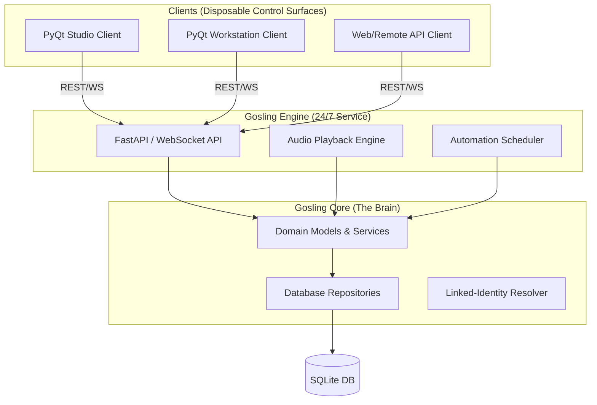

# Gosling3 Architectural Specification

This document defines the three-component architecture for Gosling3, prioritizing playback resiliency and a decoupled client-server model.

## Component Overview

---

## 1. Gosling Core (`src/core/`)
The absolute source of truth for the local data model and business logic. This layer has zero dependencies on UI or networking frameworks.

*   **Domain Models**: Typed entities (Dataclasses/Pydantic) defining the Linked-Identity model.
*   **Repositories**: Clean access to SQLite. Handles the "Identity Gap" by resolving multiple names to single identities.
*   **Business Services**: Stateless logic for data merging, library validation, and rotation rule calculations.
*   **Validation**: Enforces technical "completeness" (ProcessingStatus) before items can be scheduled.

## 2. Gosling Engine (`src/engine/`)
A background service (Windows Service/Daemon) that manages the active broadcast state.

*   **Audio Ownership**: The Engine owns the audio output device. It maintains a persistent playback buffer that is resilient to UI failures.
*   **API Provider**: Exposes a REST/WebSocket interface for all internal and external clients.
*   **Automation Logic**: Dead-air detection, timeslot switching, and the "Next Up" decision engine.
*   **State Management**: Tracks which decks are active, cue points, and as-run logging (PlayHistory).

## 3. Gosling Clients (`src/studio/`, `src/workstation/`)
Visual control surfaces built with PyQt6.

*   **Dumb-Client Architecture**: Clients are "view-only" windows. They **MUST NOT** import anything from `src/v3engine/` or `src/v3core/`. All communication is via REST/WebSocket.
*   **The Bridge**: All business requests (Unzipping, Library Updates, Playlist Edits) are sent to the Engine API. The Client only reacts to the resulting signals.

---

## 4. The Service Map (Boundary Laws)
To prevent the "Legacy Spaghetti" (logic leakage), services are strictly assigned to components:

| Service | Component | Responsibility |
| :--- | :--- | :--- |
| **IngestionService** | Engine | ZIP handling, file hashing, file system scanning. |
| **IdentityService** | Core | The Grohlton expansion logic and graph resolution. |
| **PlaybackService** | Engine | Audio hardware ownership and buffer management. |
| **Repository Layer** | Core | Primary DB access for the Engine. |

**The "PFL/Preview" Separation Law**: Gosling3 distinguishes between "Program" (On-Air) and "Preview" (PFL) audio based on the client's hardware context.

1.  **On-Air (Program)**: Always owned by the Engine's physical sound card at the station.
2.  **Local PFL (Station)**: Audio is sent to a secondary hardware output on the Engine's sound card (Studio speakers).
3.  **Remote PFL (Home)**: Audio is transcoded by the Engine and streamed over the network to the Client (Laptop speakers).

**The "Side-Panel" Rule**: UI components (Widgets) are forbidden from performing data-intensive tasks. They only send a "Trigger" to the Engine and display the state returned by the API.

---

# Specialized Specifications

For deep dives into specific logic, see:
- [v3core Models](file:///docs/v3core/MODELS.md)
- [Identity & Lookup Protocol](file:///docs/v3core/IDENTITY_AND_LOOKUP.md) (The Grohlton / Farrokh Logic)

---

# Technical Constraints (Anti-Spaghetti Laws)

1.  **Zero Contamination**: V3 components `src/v3/` MUST NOT import anything from legacy `src/` (data, business, or presentation).
2.  **Stateless Repositories**: Repositories only perform CRUD and return Pydantic DTOs. Zero business logic.
3.  **The Three-Table Rule**: SQL JOINs MUST NOT exceed a depth of 3 tables. Complex relationships (like "Grohlton" deep search or "Dave Grohl" identity expansion) MUST be resolved via multi-pass orchestration in the Service/Repository layer using Python logic.
4.  **Strict Pydantic**: All models use `extra="forbid"`. If the DB returns a column the model doesn't know about, it's an immediate fail (prevents hidden tech debt).
5.  **Deep Discovery (Grolton)**: Searching for a Person (e.g., "Dave Grohl") MUST return all songs from their Groups (Nirvana, Foo Fighters) via the expansion logic.
6.  **Immutable Specification**: Code only follows the local MD specs. If the code and spec drift, fix the spec FIRST.
